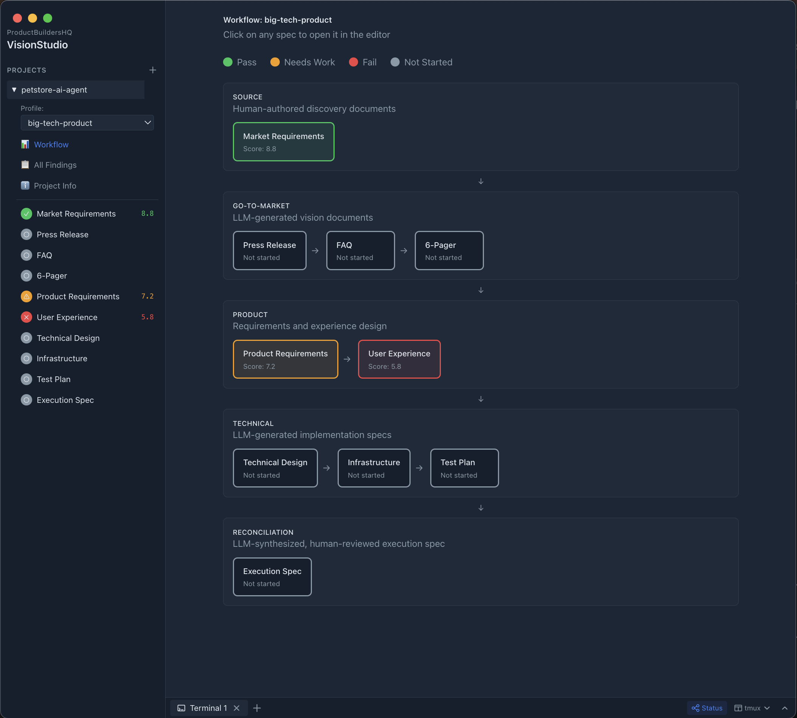
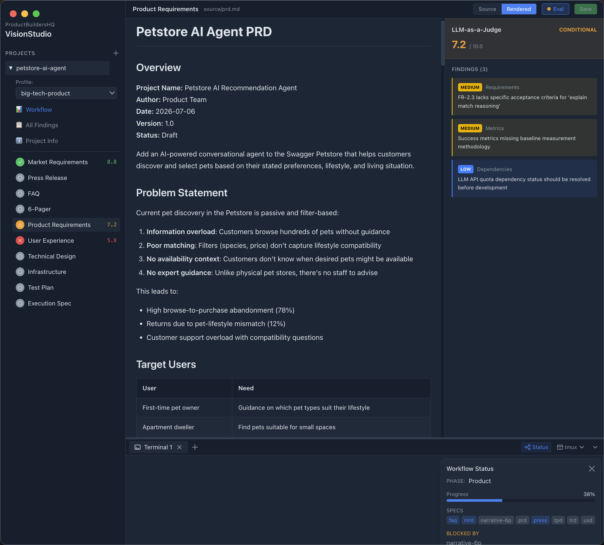
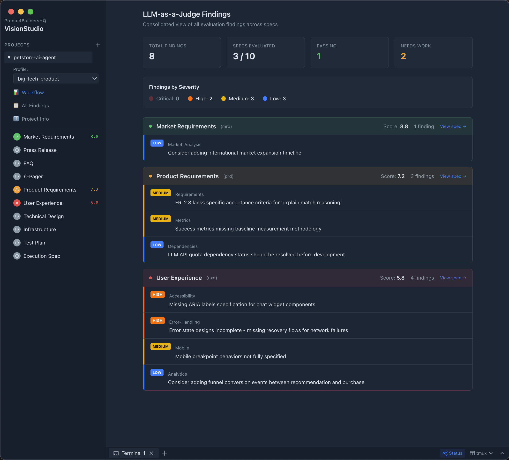

# VisionStudio

[](https://productbuildershq.com/visionstudio/)

[![Go CI][go-ci-svg]][go-ci-url]
[![Go Lint][go-lint-svg]][go-lint-url]
[![Go SAST][go-sast-svg]][go-sast-url]
[![Docs][docs-godoc-svg]][docs-godoc-url]
[![Docs][docs-mkdoc-svg]][docs-mkdoc-url]
[![Visualization][viz-svg]][viz-url]
[![License][license-svg]][license-url]

 [go-ci-svg]: https://github.com/ProductBuildersHQ/visionstudio/actions/workflows/go-ci.yaml/badge.svg?branch=main
 [go-ci-url]: https://github.com/ProductBuildersHQ/visionstudio/actions/workflows/go-ci.yaml
 [go-lint-svg]: https://github.com/ProductBuildersHQ/visionstudio/actions/workflows/go-lint.yaml/badge.svg?branch=main
 [go-lint-url]: https://github.com/ProductBuildersHQ/visionstudio/actions/workflows/go-lint.yaml
 [go-sast-svg]: https://github.com/ProductBuildersHQ/visionstudio/actions/workflows/go-sast-codeql.yaml/badge.svg?branch=main
 [go-sast-url]: https://github.com/ProductBuildersHQ/visionstudio/actions/workflows/go-sast-codeql.yaml
 [docs-godoc-svg]: https://pkg.go.dev/badge/github.com/ProductBuildersHQ/visionstudio
 [docs-godoc-url]: https://pkg.go.dev/github.com/ProductBuildersHQ/visionstudio
 [docs-mkdoc-svg]: https://img.shields.io/badge/Go-dev%20guide-blue.svg
 [docs-mkdoc-url]: https://productbuildershq.com/visionstudio
 [viz-svg]: https://img.shields.io/badge/Go-visualizaton-blue.svg
 [viz-url]: https://mango-dune-07a8b7110.1.azurestaticapps.net/?repo=ProductBuildersHQ%2Fvisionstudio
 [loc-svg]: https://tokei.rs/b1/github/ProductBuildersHQ/visionstudio
 [repo-url]: https://github.com/ProductBuildersHQ/visionstudio
 [license-svg]: https://img.shields.io/badge/license-MIT-blue.svg
 [license-url]: https://github.com/ProductBuildersHQ/visionstudio/blob/main/LICENSE

LLM-powered desktop application for specification authoring and evaluation.

## Overview

VisionStudio provides an integrated workspace for creating, evaluating, and iterating on product specifications using the VisionSpec methodology. It combines structured spec workflows with AI-assisted writing and LLM-as-a-Judge evaluation.

## Features

### Specification Authoring

- 📁 **Project Management** - Create and manage multiple spec projects
- ⚡ **Dual Methodology Selection** - Choose requirements methodology (AWS Working Backwards, etc.) and implementation methodology (AIDLC, SpecKit)
- 📊 **Visual Workflow Diagram** - See spec sequence and status at a glance
- ✏️ **Markdown Editor** - Source and rendered view toggle
- ⚖️ **LLM-as-a-Judge Evaluation** - Evaluate specs against profile rubrics
- 🤖 **LLM Writing Assistant** - Context-aware chat for spec assistance
- 📦 **Sample Projects** - Import sample projects to learn the workflow

### AIDLC Integration

- 🔄 **AIDLC Workflow** - AWS AI-Driven Development Lifecycle with Inception → Construction → Operations phases
- 📋 **Document Generation** - Generate AIDLC deliverables (Vision, Requirements, Technical Spec, etc.)
- ✅ **Phase Gates** - Track phase completion and transition requirements
- 🔁 **Sync Status** - Keep AIDLC documents synchronized with specs

### Strategic Planning

- 🎯 **V2MOM Cascade** - Hierarchical V2MOMs from Organization → Team → Project
- 🧱 **Capability Stack** - Visual capability management with domains
- 🗺️ **Roadmap View** - Timeline-based initiative and milestone planning
- 📈 **Maturity Model** - Framework-based maturity assessments with dashboards

### Organization

- 🏢 **Organization Settings** - Configure organization hierarchy and teams
- 👥 **Team Management** - Manage teams and their V2MOMs

## Screen Shots

### Workflow

Multiple workflows can be selected, including custom workflows.

[](https://productbuildershq.com/visionstudio/)

### Spec View

Individual specifications with LLM-as-a-Judge evaluations can be viewed.

[](https://productbuildershq.com/visionstudio/)

### Findings List

A list of all findings is provided for easy scanning of all findings.

[](https://productbuildershq.com/visionstudio/)

## Architecture

```
┌─────────────────────────────────────────────────────────────┐
│                    Electron Desktop App                     │
│  ┌───────────────────────────────────────────────────────┐  │
│  │              React/TypeScript Frontend                │  │
│  │  • Sidebar (projects, specs, methodology)             │  │
│  │  • Workflow diagram + AIDLC workflow                  │  │
│  │  • Markdown editor + evaluation results               │  │
│  │  • V2MOM cascade, capability stack, roadmap           │  │
│  │  • Maturity model dashboard                           │  │
│  │  • LLM chat panel                                     │  │
│  └──────────────────────┬────────────────────────────────┘  │
└─────────────────────────┼───────────────────────────────────┘
                          │ HTTP/WebSocket
┌─────────────────────────▼───────────────────────────────────┐
│                      Go Daemon                              │
│  • REST API for projects/specs/AIDLC/V2MOM/roadmap          │
│  • VisionSpec v0.13.0 integration                           │
│  • Methodology selection (requirements + implementation)    │
│  • Organization and team management                         │
│  • LLM provider abstraction (omniagent)                     │
└─────────────────────────────────────────────────────────────┘
```

## Development

### Prerequisites

- Go 1.23+
- Node.js 20+
- npm

### Setup

```bash
# Clone the repository
git clone https://github.com/ProductBuildersHQ/visionstudio.git
cd visionstudio

# Build the Go daemon
go build -o bin/daemon ./cmd/daemon/

# Install frontend dependencies
cd desktop && npm install

# Start development servers
./bin/daemon &                    # Start Go daemon
cd desktop && npm run dev:renderer &  # Start Vite
cd desktop && npm run dev:main    # Start Electron
```

### Project Structure

```
visionstudio/
├── cmd/daemon/          # Go daemon (REST API server)
│   ├── main.go          # Server setup and core routes
│   ├── aidlc.go         # AIDLC workflow handlers
│   ├── v2mom.go         # V2MOM cascade handlers
│   ├── capability.go    # Capability stack handlers
│   ├── roadmap.go       # Roadmap handlers
│   ├── organization.go  # Organization handlers
│   ├── methodologies.go # Methodology selection handlers
│   └── samples.go       # Sample projects handlers
├── pkg/
│   ├── api/             # API types
│   └── config/          # Configuration (projects, organization)
├── desktop/
│   ├── main/            # Electron main process
│   ├── renderer/src/
│   │   ├── components/
│   │   │   ├── aidlc/           # AIDLC workflow views
│   │   │   ├── v2mom/           # V2MOM cascade views
│   │   │   ├── capability-stack/ # Capability views
│   │   │   ├── roadmap/         # Roadmap views
│   │   │   ├── maturity-model/  # Maturity views
│   │   │   ├── organization/    # Organization views
│   │   │   └── samples/         # Sample picker
│   │   ├── services/    # API client
│   │   └── types/       # TypeScript types
│   └── package.json
├── samples/             # Sample projects (Grafana, Simple)
├── docs/                # MkDocs documentation
└── go.mod
```

## Related Projects

- [VisionSpec](https://github.com/ProductBuildersHQ/visionspec) - Spec orchestration library
- [OmniAgent](https://github.com/plexusone/omniagent) - LLM agent interface

## License

MIT
