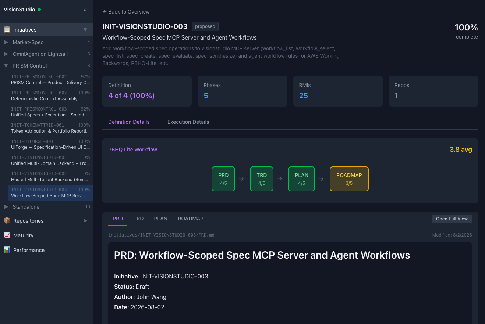
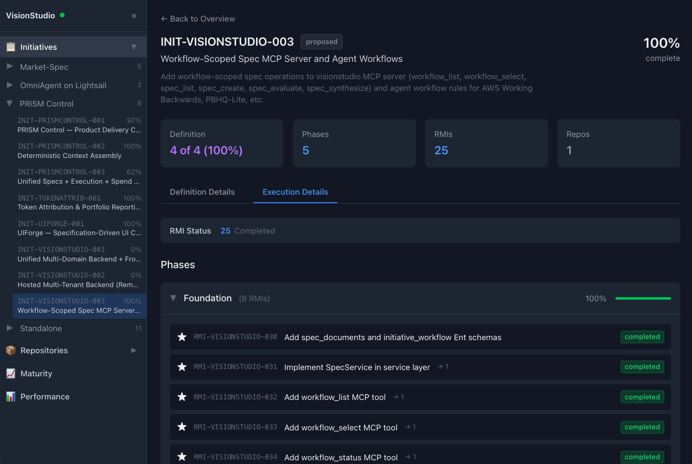
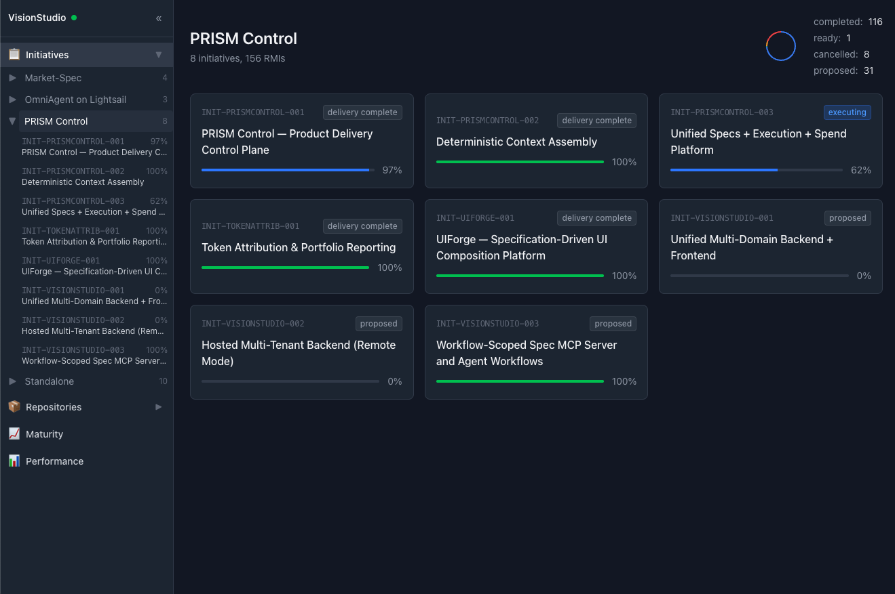
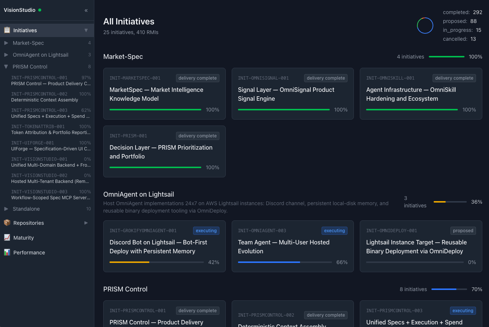
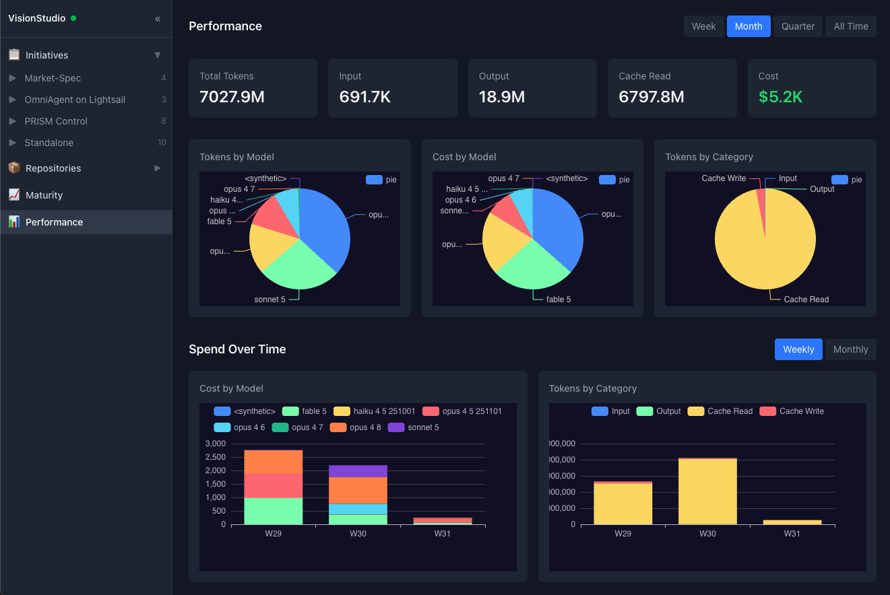
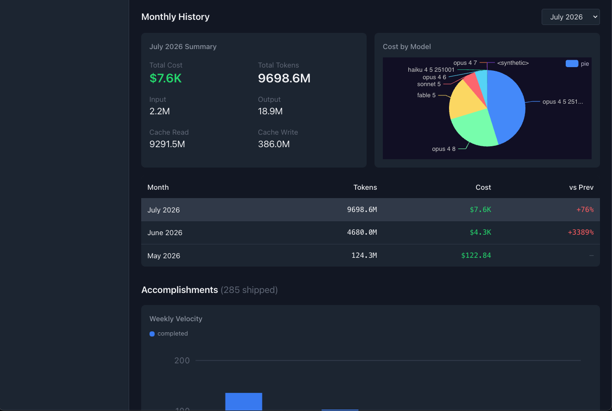

# VisionStudio

[](https://productbuildershq.com/visionstudio/)

[![Go CI][go-ci-svg]][go-ci-url]
[![Go Lint][go-lint-svg]][go-lint-url]
[![Go SAST][go-sast-svg]][go-sast-url]
[![Docs][docs-godoc-svg]][docs-godoc-url]
[![Docs][docs-mkdoc-svg]][docs-mkdoc-url]
[![Visualization][viz-svg]][viz-url]
[![License][license-svg]][license-url]

 [go-ci-svg]: https://github.com/ProductBuildersHQ/visionstudio/actions/workflows/go-ci.yaml/badge.svg?branch=main
 [go-ci-url]: https://github.com/ProductBuildersHQ/visionstudio/actions/workflows/go-ci.yaml
 [go-lint-svg]: https://github.com/ProductBuildersHQ/visionstudio/actions/workflows/go-lint.yaml/badge.svg?branch=main
 [go-lint-url]: https://github.com/ProductBuildersHQ/visionstudio/actions/workflows/go-lint.yaml
 [go-sast-svg]: https://github.com/ProductBuildersHQ/visionstudio/actions/workflows/go-sast-codeql.yaml/badge.svg?branch=main
 [go-sast-url]: https://github.com/ProductBuildersHQ/visionstudio/actions/workflows/go-sast-codeql.yaml
 [docs-godoc-svg]: https://pkg.go.dev/badge/github.com/ProductBuildersHQ/visionstudio
 [docs-godoc-url]: https://pkg.go.dev/github.com/ProductBuildersHQ/visionstudio
 [docs-mkdoc-svg]: https://img.shields.io/badge/Go-dev%20guide-blue.svg
 [docs-mkdoc-url]: https://productbuildershq.com/visionstudio
 [viz-svg]: https://img.shields.io/badge/Go-visualizaton-blue.svg
 [viz-url]: https://mango-dune-07a8b7110.1.azurestaticapps.net/?repo=ProductBuildersHQ%2Fvisionstudio
 [loc-svg]: https://tokei.rs/b1/github/ProductBuildersHQ/visionstudio
 [repo-url]: https://github.com/ProductBuildersHQ/visionstudio
 [license-svg]: https://img.shields.io/badge/license-MIT-blue.svg
 [license-url]: https://github.com/ProductBuildersHQ/visionstudio/blob/main/LICENSE

LLM-powered platform for roadmap execution, specification authoring, and evaluation.

## Overview

VisionStudio tracks cross-repository initiatives, roadmap items, and specification quality in one place. It combines a Go CLI and web dashboard (`visionstudio`) backed by Dolt (a MySQL-compatible, Git-like versioned database) with LLM-as-a-Judge evaluation of specs against workflow rubrics.

## Screenshots

<table>

<tr><th>Initiative Definition Specs</th><th>Initiative Execution Dashboard</th></tr>
<tr>
<td></td>
<td></td>
</tr>

<tr><th>Program Dashboard</th><th>Programs and Initiatives Dashboard</th></tr>
<tr>
<td></td>
<td></td>
</tr>

<tr><th>Performance Token Dashboard</th><th>Performance Token Month View</th></tr>
<tr>
<td></td>
<td></td>
</tr>

</table>

## Quick Start

```bash
git clone https://github.com/ProductBuildersHQ/visionstudio.git
cd visionstudio
go build -o bin/visionstudio ./cmd/visionstudio

# Bring up the database and web UI together, opens your browser
./bin/visionstudio app start
```

See [Installation](docs/getting-started/installation.md) and [Quick Start](docs/getting-started/quickstart.md) for the full walkthrough, including database setup, CLI usage without the browser, and the sibling repos required to build from source.

## Features

### Roadmap Execution

- 🗂️ **[Programs → Initiatives → Phases → RMIs](docs/dashboard/initiatives.md)** - Hierarchical tracking of cross-repository roadmap items, with dependencies and progress rollups; programs and initiatives can each be hidden from the dashboard (`visionstudio program hide` / `initiative hide`), with hiding a program cascading to its initiatives
- 🔁 **[Reversible Lifecycle](docs/dashboard/initiatives.md#initiative-lifecycle)** - Initiatives move forward one stage at a time (`proposed` → … → `closed`) and can reopen to any earlier stage as scope evolves, with lifecycle timestamps cleared for undone stages so history stays truthful
- 🏢 **[Repositories](docs/dashboard/repositories.md)** - Repository catalog with per-repo RMI counts and progress
- 📈 **[Performance](docs/dashboard/performance.md)** - Token spend and cost tracking by model, initiative, phase, and RMI
- 🩺 **[Maturity Assessments](docs/dashboard/maturity.md)** - Framework-based capability maturity scoring, plus SCALE platform adoption and code-leverage/reuse graphs
- 🔌 **MCP Server** - Stdio server exposing initiatives/RMIs/work assignments to agent sessions

### Specification Authoring & Evaluation

- ✏️ **[Spec Viewer](docs/dashboard/specs-and-evaluation.md)** - Source and rendered Markdown views per initiative, with PDF export
- ⚖️ **LLM-as-a-Judge Evaluation** - Evaluate specs against workflow rubrics (`structured-evaluation/rubric.Rubric`), with per-category findings and next steps
- 🔄 **Workflow Sync** - Sync `ROADMAP.md` files and spec workflows with the database

### CLI

- ▶️ **One-command startup** - `visionstudio app start` brings up the database and web UI together, closing on `Ctrl-C`
- 🗄️ **Database lifecycle** - `visionstudio db {init,start,stop,restart,status,commit}` for standalone database management
- 🩹 **Actionable diagnostics** - connection failures explain how to fix them (start the database, run migrations, etc.) instead of raw driver errors
- 🌐 **Serve from anywhere** - the web UI is embedded in the binary (`visionstudio ui --address host:port`), no separate `npm run dev` needed to use it

### DevX Usage Dashboard

- 📊 **AI Usage Dashboard** - Sessions, prompts, commits, AI-assisted %, tool calls, cost, and daily activity/cost charts, sourced from [OmniDevX](https://github.com/plexusone/omnidevx-core)
- 🔒 **Read-only, disclosure-scoped** - VisionStudio never queries the OmniDevX event store directly; it renders whatever [devfolio](https://github.com/plexusone/devfolio) already generated and decided was safe to show

<details>
<summary><strong>Legacy: per-project spec authoring (Electron desktop app, being phased out)</strong></summary>

An earlier surface — the `cmd/daemon` REST server plus an Electron desktop frontend (`desktop/`) — covers per-project spec authoring against the VisionSpec methodology directly on the filesystem (no database): dual requirements/implementation methodology selection, AIDLC workflow and document generation, V2MOM cascades, capability stacks, and organization/team settings. It's being superseded by the `visionstudio` CLI and web dashboard above and isn't under active feature development. See [Go Daemon](docs/architecture/daemon.md) and [Frontend](docs/architecture/frontend.md) for its architecture.

### Screen Shots (legacy Electron app)

#### Workflow

Multiple workflows can be selected, including custom workflows.

[](https://productbuildershq.com/visionstudio/)

#### Spec View

Individual specifications with LLM-as-a-Judge evaluations can be viewed.

[](https://productbuildershq.com/visionstudio/)

#### Findings List

A list of all findings is provided for easy scanning of all findings.

[](https://productbuildershq.com/visionstudio/)

</details>

## Architecture

```
┌───────────────────────────────────────────────────────────────┐
│                    visionstudio binary                        │
│  ┌─────────────────────────────────────────────────────────┐  │
│  │      web/ — React + Vite SPA, embedded via go:embed     │  │
│  │  • Programs → Initiatives → Phases → RMIs               │  │
│  │  • Repositories, Performance (token spend)              │  │
│  │  • Spec viewer + LLM-as-a-Judge evaluations             │  │
│  └──────────────────────┬──────────────────────────────────┘  │
│                          │ HTTP (same port)                   │
│  ┌──────────────────────▼──────────────────────────────────┐  │
│  │      cmd/visionstudio — cobra CLI + JSON API            │  │
│  │  • app/ui/db lifecycle commands                         │  │
│  │  • initiative/rmi/phase/spec/roadmap/maturity commands  │  │
│  │  • MCP stdio server for agent sessions                  │  │
│  └──────────────────────┬──────────────────────────────────┘  │
└─────────────────────────┼─────────────────────────────────────┘
                          │ pkg/store (Ent)
┌─────────────────────────▼─────────────────────────────────────┐
│                 Dolt (MySQL-compatible, Git-like)             │
└───────────────────────────────────────────────────────────────┘
```

See [Architecture Overview](docs/architecture/overview.md) for the full picture, including the type pipeline and the legacy daemon/Electron architecture it's replacing.

## Development

### Prerequisites

- Go 1.26+
- Node.js 20+
- npm
- Dolt (for the database; `visionstudio db init --migrate` sets it up)

### Setup

```bash
# Clone the repository
git clone https://github.com/ProductBuildersHQ/visionstudio.git
cd visionstudio

# Initialize the database
go run ./cmd/visionstudio db init --migrate

# Run the unified dashboard (frontend + API on one port)
go run ./cmd/visionstudio dashboard --port 9401 --unified

# Or, for frontend hot reload during UI development:
go run ./cmd/visionstudio dashboard --port 9401   # API only
cd web && npm run dev                              # Vite dev server
```

### Project Structure

```
visionstudio/
├── cmd/
│   ├── visionstudio/    # Primary CLI + unified daemon
│   │   ├── main.go      # Cobra root, global flags
│   │   ├── app.go       # `app start/status/stop/restart`
│   │   ├── serve.go     # Web UI resolution + address parsing
│   │   ├── api.go       # JSON API handlers, store→API converters
│   │   ├── db.go        # `db` subcommands
│   │   └── ...          # initiative/rmi/phase/spec/roadmap/maturity commands
│   └── daemon/          # Legacy REST server (being phased out, see README)
├── pkg/
│   ├── apitypes/        # Canonical API types (Go-first type pipeline source)
│   ├── store/            # Database layer (Ent-backed, snake_case JSON)
│   ├── service/          # Business logic
│   ├── reposcan/          # Repository discovery + scanning
│   ├── tokens/            # Token spend / cost tracking
│   ├── mcpserver/         # MCP stdio server
│   └── config/            # Configuration (projects, organization) — shared with cmd/daemon
├── ent/                  # Ent ORM schema and generated client
├── web/                  # Current React + Vite SPA (embedded into cmd/visionstudio)
│   ├── embed.go          # //go:embed all:dist
│   └── src/
│       ├── panels/       # InitiativesOverview, RepositoriesPanel, PerformancePanel, MaturityPanel, etc.
│       └── api/          # Generated types (types.gen.ts) + API client
├── desktop/              # Legacy Electron app (being phased out, see README)
├── samples/              # Sample projects (Grafana, Simple)
├── docs/                 # MkDocs documentation
└── go.mod
```

## Ecosystem

VisionStudio is the top layer of the ProductBuildersHQ spec stack
(`visionstudio → visionspec → specification-workflow-spec`); see the
[Ecosystem architecture page](docs/architecture/ecosystem.md) for how the
layers interact.

- [specification-workflow-spec](https://github.com/ProductBuildersHQ/specification-workflow-spec) - The contract: workflow types, schemas, and the embedded 24-workflow library (configs, templates, rubrics) VisionStudio loads directly
- [VisionSpec](https://github.com/ProductBuildersHQ/visionspec) - The engine: scaffolding, LLM synthesis, LLM-as-Judge evaluation, lint/drift/status, and MCP server, consumed as an imported SDK

## Related Projects

- [OmniAgent](https://github.com/plexusone/omniagent) - LLM agent interface
- [omnidevx-core](https://github.com/plexusone/omnidevx-core) - Canonical developer-experience telemetry model, the source of the DevX dashboard's data
- [devfolio](https://github.com/plexusone/devfolio) - Generates the DevX dashboard file VisionStudio renders (`devfolio devx dashboard`)
- [dashforge](https://github.com/plexusone/dashforge) - Dashboard-IR format the DevX dashboard is rendered from

## License

MIT
